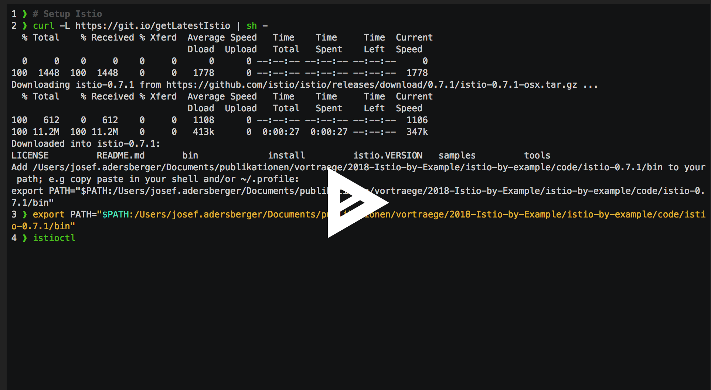
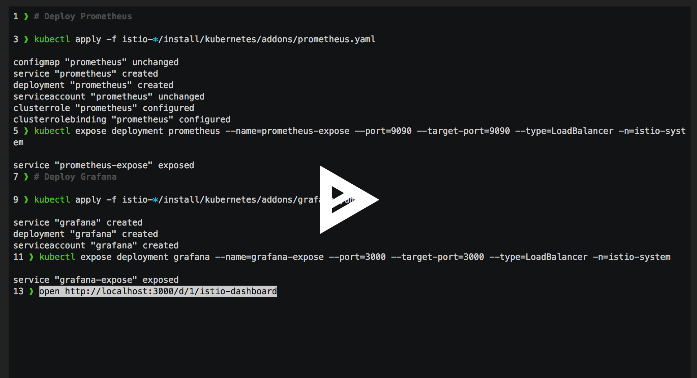

background-color: 283D8F


^ Hey! I'm Josef and this my talk on Istio - by example!

---

# Why?

^ 
You might ask why another Istio talk...
The answer is...

---


^ 
Istio and service meshes are a hype right now
Our job is to ground this hype by providing real-life use cases
So what is Istio in 20 seconds?

---


^ 
microservice applications do have a lot of crosscutting concerns to address to be cloud native

---


^ 
these concerns can be addressed by libraries

---
# Library Bloat


^ 
but this leads to a library bloat

---


^ 
so the idea is to move those concerns from the application side to the infrastructure side

---


^ 
and this is where Istio comes up:
It unburdens cloud native applications to address crosscutting concerns by themselves.

---
#Setting the sails with Istio


^ 
now let's dig into Istio - example by example
first task is to setup a Istio mesh

---
# Baby step: Install a (local) Kubernetes cluster


^ 
it all begins with a k8s cluster

---
# Step 1: Deploy Istio and a Sample Application



[Video](https://asciinema.org/a/mHs3nesM9oOwOiESleaWwe5Jw)

^ 
then you've to deploy Istio itself and a sample application

---
# Step 2: Deploy Istio Observability Stack



[Video](https://asciinema.org/a/oZMovBrx0TpP2AS7UNTLslI6P)

^ 
along with Istio you've to deploy an Observability stack

---
# Stimulate!
 ```zsh
wget -P /usr/local/bin https://github.com/adersberger/slapper/releases/download/0.1/slapper

slapper -rate 4 -targets ./target -workers 2 -maxY 15s
 ```

^ 
now let's stimulate the sample application and have a look on what we can observe
with this stack in place you're now able to play around with Istio
I'm coming to an end by flipping through the toys you can use 

---
# Canary Releases: A/B Testing

 ```yaml
apiVersion: config.istio.io/v1alpha2
kind: RouteRule
metadata:
  name: reviews-test-v2
spec:
  destination:
    name: reviews
  precedence: 2
  match:
    request:
      headers:
        cookie:
          regex: "^(.*?;)?(user=jason)(;.*)?$"
  route:
  - labels:
      version: v2
```
```zsh
istioctl create -f route-rule-reviews-test-v2.yaml
```
---
# Canary Releases: Rolling Upgrade

 ```yaml
apiVersion: config.istio.io/v1alpha2
kind: RouteRule
metadata:
  name: reviews-default
spec:
  destination:
    name: reviews
  precedence: 1
  route:
  - labels:
      version: v1
    weight: 50
  - labels:
      version: v3
    weight: 50
```
```zsh
istioctl create -f route-rule-reviews-50-v3.yaml
```
---
# Canary Releases: Blue/Green
 ```yaml
apiVersion: config.istio.io/v1alpha2
kind: RouteRule
metadata:
  name: reviews-default
spec:
  destination:
    name: reviews
  precedence: 1
  route:
  - labels:
      version: v3
    weight: 100
```
```zsh
istioctl replace -f route-rule-reviews-v3.yaml
```

---
# Security: Access Control
 ```yaml
apiVersion: "config.istio.io/v1alpha2"
kind: denier
metadata:
  name: denyreviewsv3handler
spec:
  status:
    code: 7
    message: Not allowed
---
apiVersion: "config.istio.io/v1alpha2"
kind: checknothing
metadata:
  name: denyreviewsv3request
spec:
---
apiVersion: "config.istio.io/v1alpha2"
kind: rule
metadata:
  name: denyreviewsv3
spec:
  match: source.labels["layer"]=="inner" && destination.labels["layer"] == "outer"
  actions:
  - handler: denyreviewsv3handler.denier
    instances: [ denyreviewsv3request.checknothing ]
```
^
https://medium.com/@szihai_37982/how-to-write-istio-mixer-policies-50dc639acf75

---

# Security: Egress
 ```yaml
apiVersion: networking.istio.io/v1alpha3
kind: ExternalService
metadata:
  name: google-ext
spec:
  hosts:
  - www.google.com
  ports:
  - number: 443
    name: https
    protocol: http
---
apiVersion: networking.istio.io/v1alpha3
kind: DestinationRule
metadata:
  name: google-ext
spec:
  name: www.google.com
  trafficPolicy:
    tls:
      mode: SIMPLE # initiates HTTPS when talking to www.google.com
```

---
# Resiliency: Circuit Breaker
 ```yaml
apiVersion: networking.istio.io/v1alpha3
kind: DestinationRule
metadata:
  name: httpbin
spec:
  name: httpbin
  trafficPolicy:
    connectionPool:
      tcp:
        maxConnections: 100
      http:
        http1MaxPendingRequests: 1
        maxRequestsPerConnection: 1
    outlierDetection:
      http:
        consecutiveErrors: 1
        interval: 1s
        baseEjectionTime: 3m
        maxEjectionPercent: 100
 ```
---
# Resiliency: Latency Injection
```yaml
apiVersion: config.istio.io/v1alpha2
kind: RouteRule
metadata:
  name: ratings-delay
spec:
  destination:
    name: reviews
  route:
  - labels:
      version: v1
  httpFault:
    delay:
      percent: 10
      fixedDelay: 5s
 ```
---
# Resiliency: Error Injection
```yaml
apiVersion: config.istio.io/v1alpha2
kind: RouteRule
metadata:
  name: ratings-abort
spec:
   destination:
     name: ratings
   route:
   - labels:
       version: v1
   httpFault:
     abort:
       percent: 10
       httpStatus: 400
 ```
---

#https://github.com/adersberger/istio-by-example

---
